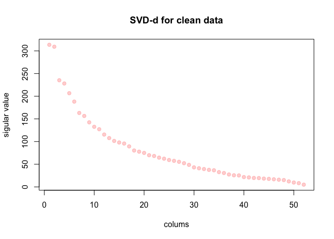

# Machine_learning
xvshiting  
Sunday,27,september  
## Abstract

Using devices such as Jawbone Up, Nike FuelBand, and Fitbit it is now possible to collect a large amount of data about personal activity relatively inexpensively. These type of devices are part of the quantified self movement – a group of enthusiasts who take measurements about themselves regularly to improve their health, to find patterns in their behavior, or because they are tech geeks. One thing that people regularly do is quantify how much of a particular activity they do, but they rarely quantify how well they do it. In this project, your goal will be to use data from accelerometers on the belt, forearm, arm, and dumbell of 6 participants. They were asked to perform barbell lifts correctly and incorrectly in 5 different ways.This report is about predicting the manner n which people did their exercises based on the data from wearable sensors.


##Loading and processing the data


```r
download.file("https://d396qusza40orc.cloudfront.net/predmachlearn/pml-training.csv",destfile = "pml-training.csv", 
              method = "curl")
```


```r
pml_data <- read.csv("pml-training.csv")
```

##Clean data
In the data there are many variables in the pml_data set with missing value,we should drop those colums we just use the residual colums to make a predict.We use the below data to choose the variable don't have missing value .Most important we reduce the col which value isn't numeric except the outcome colum.


```r
library(dplyr,warn.conflicts = FALSE)
library(caret,warn.conflicts = FALSE)
```

```
## Loading required package: lattice
## Loading required package: ggplot2
```

```r
set.seed(1234)
pml_data<-pml_data[,-c(1,2,3,4,5,6,7)]
pml_data<-pml_data[,colSums(is.na(pml_data)|pml_data=="")/nrow(pml_data)==0]
non.numeric.values <- mapply(is.numeric, pml_data, SIMPLIFY = TRUE)
non.numeric.values["classe"] <- TRUE # avoid removing the outcome
pml_data <- pml_data[ , non.numeric.values]
names(pml_data)
```

```
##  [1] "roll_belt"            "pitch_belt"           "yaw_belt"            
##  [4] "total_accel_belt"     "gyros_belt_x"         "gyros_belt_y"        
##  [7] "gyros_belt_z"         "accel_belt_x"         "accel_belt_y"        
## [10] "accel_belt_z"         "magnet_belt_x"        "magnet_belt_y"       
## [13] "magnet_belt_z"        "roll_arm"             "pitch_arm"           
## [16] "yaw_arm"              "total_accel_arm"      "gyros_arm_x"         
## [19] "gyros_arm_y"          "gyros_arm_z"          "accel_arm_x"         
## [22] "accel_arm_y"          "accel_arm_z"          "magnet_arm_x"        
## [25] "magnet_arm_y"         "magnet_arm_z"         "roll_dumbbell"       
## [28] "pitch_dumbbell"       "yaw_dumbbell"         "total_accel_dumbbell"
## [31] "gyros_dumbbell_x"     "gyros_dumbbell_y"     "gyros_dumbbell_z"    
## [34] "accel_dumbbell_x"     "accel_dumbbell_y"     "accel_dumbbell_z"    
## [37] "magnet_dumbbell_x"    "magnet_dumbbell_y"    "magnet_dumbbell_z"   
## [40] "roll_forearm"         "pitch_forearm"        "yaw_forearm"         
## [43] "total_accel_forearm"  "gyros_forearm_x"      "gyros_forearm_y"     
## [46] "gyros_forearm_z"      "accel_forearm_x"      "accel_forearm_y"     
## [49] "accel_forearm_z"      "magnet_forearm_x"     "magnet_forearm_y"    
## [52] "magnet_forearm_z"     "classe"
```


We split the clean data into two parts,the training part occupy 60% and 20% testing data,20% cross validation set.

```r
training<-createDataPartition(y=pml_data$classe,p=0.6,list = FALSE)
Trian_data<-pml_data[training,]
test_data<-pml_data[-training,]
testing<-createDataPartition(y=test_data$classe,p=0.5,list = FALSE)
validation_data<-test_data[testing,]
test_data<-test_data[-testing,]
```

##Choose predictor-SVD

Then we plot the sigular value of the Training data,So look at this figure we could see we can pick up head of 1-20 variables to be predictor.

 

##Fit Model-Random Forest

We use the random forest method and our traning sample error is 2.8%.


```r
require(randomForest)
```

```
## Loading required package: randomForest
## randomForest 4.6-10
## Type rfNews() to see new features/changes/bug fixes.
## 
## Attaching package: 'randomForest'
## 
## The following object is masked from 'package:dplyr':
## 
##     combine
```

```r
pre<-train_data[,-21]
des<-train_data[,21]
rffit <-randomForest(pre, des)
rffit
```

```
## 
## Call:
##  randomForest(x = pre, y = des) 
##                Type of random forest: classification
##                      Number of trees: 500
## No. of variables tried at each split: 4
## 
##         OOB estimate of  error rate: 2.67%
## Confusion matrix:
##      A    B    C    D    E class.error
## A 3279   19   13   32    5  0.02060932
## B   24 2222   32    1    0  0.02501097
## C    9   59 1951   34    1  0.05014606
## D    8    3   40 1871    8  0.03056995
## E    8    8    8    2 2139  0.01200924
```

## cross validation

Our cross validation accuracy is 97.43%,so that means our model don't have a overfit probelm,Maybe we could add more feature to improve the accuracy,but this accuracy use 20 features to predict is just fine.

```r
predClass <- predict (rffit, validation_data)
confusionMatrix (validation_data$classe,predClass)
```

```
## Confusion Matrix and Statistics
## 
##           Reference
## Prediction    A    B    C    D    E
##          A 1098    5    8    5    0
##          B   12  741    6    0    0
##          C    3   24  648    8    1
##          D    7    0   13  619    4
##          E    6    4    2    0  709
## 
## Overall Statistics
##                                           
##                Accuracy : 0.9725          
##                  95% CI : (0.9669, 0.9774)
##     No Information Rate : 0.287           
##     P-Value [Acc > NIR] : < 2.2e-16       
##                                           
##                   Kappa : 0.9652          
##  Mcnemar's Test P-Value : NA              
## 
## Statistics by Class:
## 
##                      Class: A Class: B Class: C Class: D Class: E
## Sensitivity            0.9751   0.9574   0.9572   0.9794   0.9930
## Specificity            0.9936   0.9943   0.9889   0.9927   0.9963
## Pos Pred Value         0.9839   0.9763   0.9474   0.9627   0.9834
## Neg Pred Value         0.9900   0.9896   0.9910   0.9960   0.9984
## Prevalence             0.2870   0.1973   0.1726   0.1611   0.1820
## Detection Rate         0.2799   0.1889   0.1652   0.1578   0.1807
## Detection Prevalence   0.2845   0.1935   0.1744   0.1639   0.1838
## Balanced Accuracy      0.9843   0.9758   0.9730   0.9861   0.9946
```

There is the wrong predicted result.

 

##Result

We use this fit model on our 20 test samples.


```r
test <- read.csv("pml-testing.csv")
test<-test[,-c(1,2,3,4,5,6,7)]
test<-test[,colSums(is.na(test)|test=="")/nrow(test)==0]
non.numeric.values <- mapply(is.numeric, test, SIMPLIFY = TRUE)
test<- test[ , non.numeric.values]
test<-test[,1:20]
predClass <- predict (rffit, test)
print(predClass)
```

```
##  1  2  3  4  5  6  7  8  9 10 11 12 13 14 15 16 17 18 19 20 
##  B  A  B  A  A  E  D  B  A  A  B  C  B  A  E  E  A  B  B  B 
## Levels: A B C D E
```
